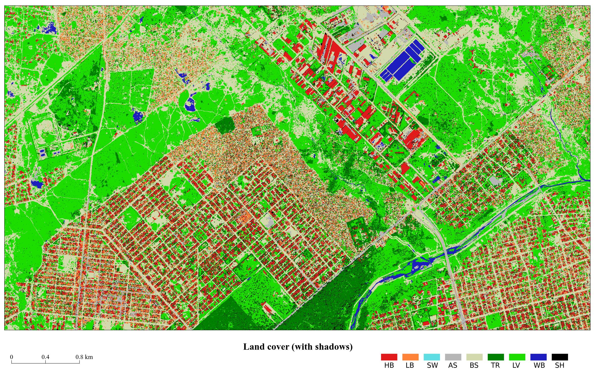
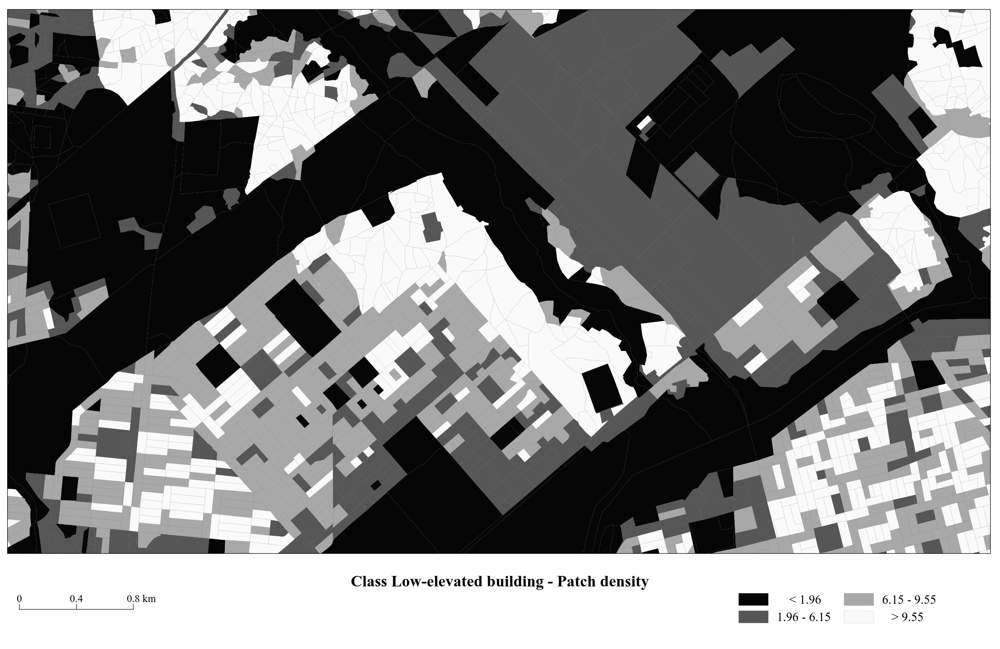
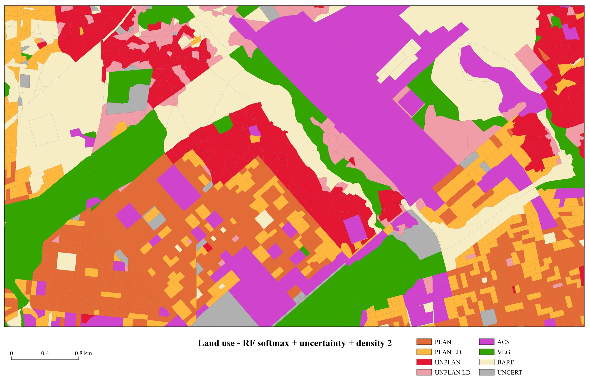

# Street blocks features computation
 
This repository contain the python script (in a jupyter notebook) used for computing landscapes metrics in street blocks or any other landscape unit defined as a shapefile to be provided by the user.

This code was published belong to the following paper:

Grippa & al. 	Mapping Urban Land Use at Street Block Level Using OpenStreetMap, Remote Sensing Data, and Spatial Metrics. ISPRS Int. J. Geo-Inf. 2018, 7, 246. [doi:10.3390/ijgi7070246](https://doi.org/10.3390/ijgi7070246)

## Cite this code
Please use the following DOI for citing this code: 

## Related code
The code provided in this repository compute spatial metrics for a layer of polygons. When working on urban environment, these polygons could be, for example, street blocks in order to classify land use. Another repository provide a computer code to create street block geometries from OpenStreetMap data => [https://github.com/ANAGEO/OSM_Streetblocks_extraction](https://github.com/ANAGEO/OSM_Streetblocks_extraction).

## Outputs
The code relies on GRASS GIS and mainly on the [r.li suite](https://grass.osgeo.org/grass74/manuals/r.li.html). 
It enable for automated creation of the r.li configuration files which otherwise should be created in the graphical user interface [more info](https://grass.osgeo.org/grass75/manuals/g.gui.rlisetup.html).

The script is supposed to work with a user-provided land cover map, NDVI, NDWI, nDSM. If any of them is missing, the user would need to adapt the code. 

**The script will compute the following landscape metrics**

Spatial metrics at the "landscape" level:
- Dominance
- Pielou
- Renyi
- Richness
- Shannon
- Simpson

Spatial metrics at the "class" level:
- *"patchnum"* : Patch number
- *"patchdensity"* : Patch density
- *"mps"* : Mean patch size
- *"padsd"* : Stand. dev. of patch size
- *"padcv"* : Patch size coef. of variation
- *"padrange"* : Range of patch size
- *"shape"* : Shape index
- *"prop_xx"* :  Proportion of the class

Street blocks morphology metrics:
- *"area"* : Area
- *"perimeter"* : Perimeter
- *"compact_circle"* : Compactness relative to a circle
- *"compact_square"* : Compactness relative to a square
- *"fd"* : Fractal dimention

Spectral metrics:
- *"ndvi_stddev"* and *"ndvi_median"* : Std. dev. and median of NDVI
- *"ndwi_stddev"* and *"ndwi_median"* : Std. dev. and median of NDWI
 
Other metrics:
- *"mean_build_height"* : Mean nDSM value of built pixels 
- *"count_buildpixels"* : Number of built pixels in the block

## Example 
Here after are presented few spatial metrics computed on a land cover map and used as main features for land use classification at the streetblock level. 

**Land cover map**
 
**Shannon index (landscape level)**
 
**Patch density on "low elevated building" class (class level)**
 
**Landuse classification**
 
